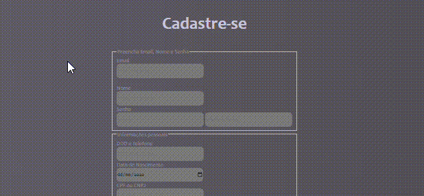

# Índice

[Projeto](https://github.com/MarshyyUWU/cadastroJava/blob/main/README.md#projeto---criando-tela-de-cadastro-com-javascript)  
[Descrição](https://github.com/MarshyyUWU/cadastroJava/blob/main/README.md#%EF%B8%8Fdescri%C3%A7%C3%A3o)  
[Funcionalidade](https://github.com/MarshyyUWU/cadastroJava/blob/main/README.md#funcionalidade)  
[Tecnologias utilizadas](https://github.com/MarshyyUWU/cadastroJava/blob/main/README.md#tecnologias-utilizadas)  
[Fontes consultoras](https://github.com/MarshyyUWU/cadastroJava/blob/main/README.md#fontes-consultadas)   
[Autores](https://github.com/MarshyyUWU/cadastroJava/blob/main/README.md#autores)

# 💕Projeto - Criando tela de Cadastro com JavaScript

## ❤️Descrição

Estou documentando trabalhos para contar como nota dia 15/09. Aonde preciso documentar READMES nos repositórios já existentes.

## 😘Funcionalidade

- `Email`  
- `Nome`  
- `Senha`  
---  
- `DDD e telefone`  
- `Data de nascimento`  
- `CPF OU CNPJ`  
---  
- `CEP`  
- `Endereço`  
- `Número`  
- `Complemento`  
- `Bairro`  
- `cidade`  
- `Estado`  
- `Ponto de Referência`  
### 💖Tecnologias utilizadas

#### VSCODE
- Version: 1.80.2 (system setup)  
- Commit: 2ccd690cbff1569e4a83d7c43d45101f817401dc  
- Date: 2023-07-27T20:40:28.909Z  
- Electron: 22.3.14  
- ElectronBuildId: 22695494  
- Chromium: 108.0.5359.215   
- V8: 10.8.168.25-electron.0  
- OS: Windows_NT x64 10.0.22000  
## 🥰Fontes consultadas

* [Alura](https://www.alura.com.br/artigos/escrever-bom-readme) - Como escrever um README incrível
* [Github](https://gist.github.com/lohhans/f8da0b147550df3f96914d3797e9fb89) - Um modelo para fazer um bom README.md

## 😍Autores
* [Marsh](https://github.com/MarshyyUWU)

